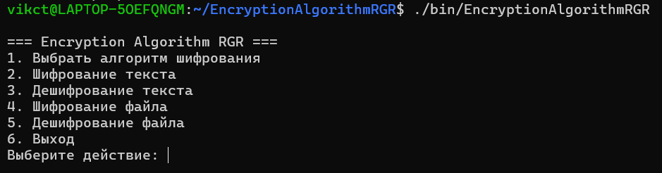
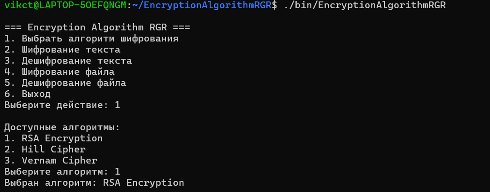
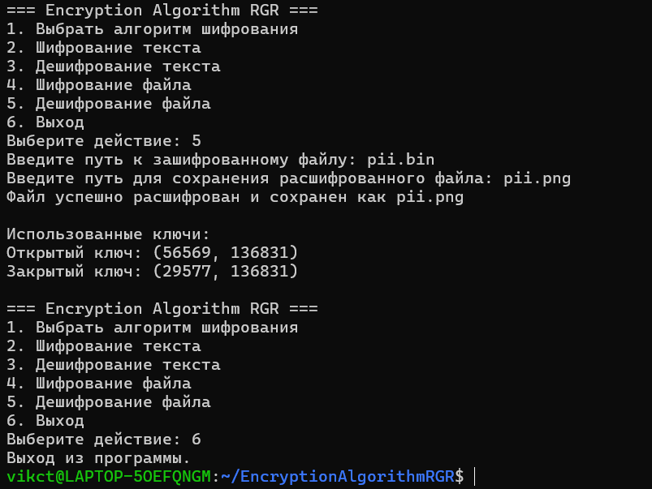
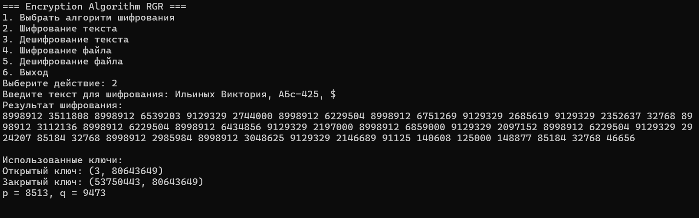

# Расчетно-графическая работа по Программированию
Проект первого курса

Консольное приложение на C++ для системы Linux, демонстрирующее работу нескольких алгоритмов шифрования для текста и файлов.


## Описание

Приложение представляет собой интерфейс и реализацию следующих криптографических алгоритмов:

* **RSA** - Асимметричный алгоритм шифрования.
* **Шифр Хилла** - Полиграммный шифр подстановки, основанный на принципах линейной алгебры и модульной арифметики.
* **Шифр Вернама** - Метод шифрования одноразовый блокнот, основанный на операции XOR.

Приложение позволяет:
* Шифровать и дешифровать текст, вводимый с клавиатуры.
* Шифровать и дешифровать файлы.

Исходный код и скриншоты находятся в данном репозитории.

## Возможности

* **Интуитивно понятный интерфейс**: Разделение операций для текста и файлов.
* **Поддержка нескольких алгоритмов**: RSA, шифр Хилла и Вернама.
* **Операции с текстом**:
    * Выбор алгоритма.
    * Ввод текста для шифрования/дешифрования.
    * Шифрование/дешифрование текста выбранным алгоритмом.
    * Вывод зашифрованного/дешифрованного текста.
* **Операции с файлами**:
    * Выбор файла.
    * Шифрование/дешифрование файла выбранным алгоритмом.
    * Сохранение зашифрованного/расшифрованного файла.
    * Предложение создать файл для шифрования/дешифрования.
* **Управление ключами**:
    * Генерация пар ключей RSA.
    * Генерация случайной обратимой матрицы 2×2 для шифра Хилла.
    * Генерация ключа с помощью хещирования пароля от пользователя для шифра Вернама.
* **Обратная связь**: Информационные сообщения о статусе операций и ошибках.

## 🛠️ Стек технологий

* **C++**: Основной язык реализации криптографических алгоритмов.
* **Динамические библиотеки** (.so): Алгоритмы подгружаются через `dlopen`  
* **CMake**: Сборка проекта  
* **Linux**: Целевая ОС (тестировалось на Ubuntu)  

##  Скриншоты

Ниже представлены скриншоты основных меню и этапов работы приложения.

**1. Главное меню**


**2. Меню выбора алгоритма**


**3. Пример шифрования текста**


**3. Пример шифрования файла**



##  Структура проекта

* `main.cpp`: Точка входа приложения (инициализация `MenuController`).
* `menu_controller.cpp/.h`: Главный управляющий класс с консольным интерфейсом.
  
* **Core Components**:
    * `encryption_interface.h`: Базовый абстрактный класс для алгоритмов шифрования.
    * `file_utils.cpp/.h`: Утилиты для работы с файлами (чтение/запись бинарных данных, hex-конвертация).

* **Algorithms (C++ Implementations)**:
    * `hill.cpp/.h`: Реализация шифра Хилла (матричное шифрование).
    * `rsa.cpp/.h`: Реализация RSA (асимметричное шифрование).
    * `vernam.cpp/.h`: Реализация шифра Вернама (XOR-шифрование).

* **Dynamic Libraries**:
    * `librsa.so`: Скомпилированная библиотека для RSA.
    * `libhill.so`: Скомпилированная библиотека для шифра Хилла.
    * `libvernam.so`: Скомпилированная библиотека для Вернама.

* **Build System**:
    * `CMakeLists.txt`: Конфигурация сборки (исполняемый файл + динамические библиотеки).

## 🚀 Установка и запуск

1.  Клонируйте репозиторий:
    ```bash
    git clone https://github.com/rozetkaimg/encryption_algorithm_rgr
    ```
2.  Соберите проект
    ```bash
    mkdir build && cd build
    cmake ..
    make
    ```
3.  Соберите проект
    ```bash
    ./bin/EncryptionAlgorithmRGR
    ```
    

## Замечания по реализации

* **Безопасность**: Данный проект является учебным и демонстрационным. Реализованные алгоритмы (особенно заглушки и простые шифры) **не следует использовать для защиты реальных конфиденциальных данных**.
